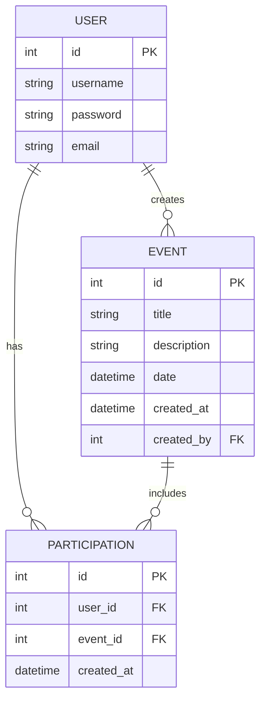

# Gestionnaire d'Événements - Projet Django

Ce projet est une application web Django permettant de gérer des événements. Les utilisateurs peuvent créer des événements et indiquer leur participation. Les visiteurs non connectés peuvent voir la liste des événements et le nombre de participants, mais ne peuvent pas participer sans se connecter.

## Fonctionnalités

- **Gestion des utilisateurs** :
  - Inscription
  - Connexion/Déconnexion
  - Authentification requise pour certaines actions

- **Gestion des événements** :
  - Liste des événements avec date et nombre de participants
  - Détail d'un événement
  - Création d'événements (utilisateurs connectés uniquement)
  - Participation à un événement (utilisateurs connectés uniquement)
  - Annulation de participation

- **Interface d'administration** :
  - Gestion complète des événements
  - Gestion des participations
  - Interface Django admin personnalisée

## Structure du projet

```
event_manager/
│
├── accounts/                # Application de gestion des utilisateurs
│   ├── migrations/
│   ├── templates/
│   │   ├── login.html       # Page de connexion
│   │   └── register.html    # Page d'inscription
│   ├── admin.py
│   ├── apps.py
│   ├── models.py
│   ├── tests.py
│   ├── urls.py              # URLs de l'application accounts
│   └── views.py             # Vues de l'application accounts
│
├── events/                  # Application de gestion des événements
│   ├── migrations/
│   ├── templates/
│   │   ├── event_detail.html # Page de détail d'un événement
│   │   ├── event_form.html   # Formulaire de création d'événement
│   │   └── event_list.html   # Liste des événements
│   ├── admin.py             # Configuration de l'interface d'administration
│   ├── apps.py
│   ├── models.py            # Modèles Event et Participation
│   ├── tests.py
│   ├── urls.py              # URLs de l'application events
│   └── views.py             # Vues de l'application events
│
├── event_manager/           # Projet principal
│   ├── settings.py          # Configuration du projet
│   ├── urls.py              # URLs principales
│   ├── wsgi.py
│   └── asgi.py
│
├── templates/               # Templates globaux
│   └── base.html            # Template de base (layout)
│
├── .gitignore               # Fichiers à ignorer par Git
├── manage.py                # Script de gestion Django
└── README.md                # Ce fichier
```

## Modèle de données

Le projet utilise trois entités principales :



- **User** : Utilisateur du système (modèle Django par défaut)
- **Event** : Événement créé par un utilisateur
- **Participation** : Relation entre un utilisateur et un événement (table d'association)

## Prérequis

- Python 3.8 ou supérieur
- Django 4.2 ou supérieur

## Installation

1. Clonez ce dépôt :
   ```bash
   git clone <URL_du_dépôt>
   cd event_manager
   ```

2. Créez un environnement virtuel (optionnel mais recommandé) :
   ```bash
   python -m venv venv
   source venv/bin/activate  # Sur Windows : venv\Scripts\activate
   ```

3. Installez les dépendances :
   ```bash
   pip install django
   ```

4. Appliquez les migrations :
   ```bash
   python manage.py makemigrations
   python manage.py migrate
   ```

5. Créez un superutilisateur :
   ```bash
   python manage.py createsuperuser
   ```

6. Lancez le serveur de développement :
   ```bash
   python manage.py runserver
   ```

7. Accédez à l'application à l'adresse http://127.0.0.1:8000/

## URLs principales

- `/` : Page de connexion
- `/events/` : Liste des événements
- `/events/<id>/` : Détail d'un événement
- `/events/create/` : Création d'un événement (utilisateurs connectés uniquement)
- `/accounts/login/` : Connexion
- `/accounts/logout/` : Déconnexion
- `/accounts/register/` : Inscription
- `/admin/` : Interface d'administration

## Gestion des fichiers avec Git

Pour éviter de versionner des fichiers inutiles avec Git, un fichier `.gitignore` a été créé à la racine du projet. Les principaux fichiers ignorés sont :

- `__pycache__/` et fichiers compilés Python (`.pyc`, `.pyo`, etc.)
- Base de données SQLite (`db.sqlite3`)
- Environnements virtuels
- Fichiers système (`.DS_Store`, `Thumbs.db`, etc.)

### Commandes Git utiles

Pour nettoyer les fichiers déjà versionnés qui devraient être ignorés :

```bash
# Désindexer les fichiers sans les supprimer physiquement
git rm --cached -r .

# Réindexer tous les fichiers (sauf ceux ignorés)
git add .

# Valider les changements
git commit -m "Nettoyage des fichiers ignorés"
```

Pour supprimer les fichiers `__pycache__` de votre système :

```bash
# Linux/Mac
find . -name "__pycache__" -type d -exec rm -rf {} +
find . -name "*.pyc" -delete

# Windows (PowerShell)
Get-ChildItem -Path . -Include "__pycache__" -Recurse -Directory | Remove-Item -Recurse -Force
Get-ChildItem -Path . -Include "*.pyc" -Recurse -File | Remove-Item -Force
```

## Sécurité

Cette application gère l'authentification des utilisateurs et la protection des routes privées :

- Utilisation du jeton CSRF (``) dans tous les formulaires pour prévenir les attaques CSRF
- Protection des routes sensibles avec le décorateur `@login_required`
- Vérification de l'authentification des utilisateurs avant les actions restreintes
- Interface d'administration Django sécurisée

## Développement

### Ajout de fonctionnalités

Pour ajouter des fonctionnalités à ce projet :

1. Modifiez ou créez de nouveaux modèles dans `models.py`
2. Créez les migrations : `python manage.py makemigrations`
3. Appliquez les migrations : `python manage.py migrate`
4. Ajoutez les vues correspondantes dans `views.py`
5. Mettez à jour les URLs dans `urls.py`
6. Créez ou modifiez les templates dans le dossier `templates/`

### Tests

Pour exécuter les tests :

```bash
python manage.py test
```

## Personnalisation

Le projet utilise un style CSS simple intégré dans le template `base.html`. Vous pouvez personnaliser l'apparence en modifiant ce template, sans avoir recours à JavaScript comme demandé dans les spécifications initiales.